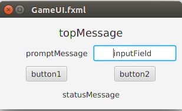
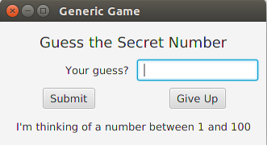

## Example Graphical Application using JavaFX

This is a simple guessing game with a form-based graphical user-interface using JavaFX.
JavaFX is a set of classes and tools for creating graphical applications.
The JavaFX classes are included in the Java API and Java Development Kit.
There is a separate visual editor named *SceneBuilder* for creating the user interface. See below for how to get SceneBuilder.

## Overview of GUI App Design

Applications with a graphical user interface (GUI) divide the code into these components, based on functionality:

* **User Interface** or **View** contains components, layout information, and formatting of the UI.
* **Controller** handle events from the View, updates the View, and acts as a bridge between the View and the application.
* **Model** or Application, contains the logic (and code) for the application.  It usually has no knowledge of the View and Controller, but responds to requests (method calls) from them.  The Model typically consists of many classes and may itself be divided into components or layers.

And one other class:

* **Application** or **Main** class that starts the application.  It creates initial objects for model, view, and controller, and connects them as needed. Its usually very short.


## Example Game Application Using JavaFX

This project contains a sample game that you can customize or extend.  It is general enough that you can modify
it to play other games without modifying the UI (View) class.

* **GameUI.fxml** - user interface using JavaFX (written in SceneBuilder)
* **GameController.java** - controller handles events from UI and updates the UI
* **GameModel.java** - a guessing game.  Has methods for communicating with the controller.
* **GameApp.java** - "main" class that configures the application and launches the UI.

Each component is explained below.

## GameUI.fxml - user interface in JavaFX

The (simple) user interface contains these components:



The figure shows the name of each component, which is also its "id" used by JavaFX (the "fx:id").  The layout is saved in an FXML file, a variety of XML that JavaFX processes to create the UI.

The components are just Labels, Buttons, and one TextField arranged using a GridLayout, and created in SceneBuilder.

To edit this file in Eclipse, right click on the file and choose "Open with SceneBuilder".

## GameController.java

This class handles **events** generated from the View (UI) and updates the UI.  It also initializes the text shown in the UI.

Here is part of the code for the controller:
```java
public class GameController {
    /** Reference to the game (model) we are playing. */
    private GameModel game;
	@FXML
	Label topMessage;     // message displayed at top of window
	@FXML
	Label promptMessage;  // prompt before the input field
	@FXML
	Label statusMessage;  // for errors, results. Shown at bottom.
	@FXML
	TextField inputField; // user input field
	@FXML
	Button button1;       // usually the submit button
	@FXML
	Button button2;       // clear, quit, or cancel button

  @FXML
  public void initialize() {
    // initialize controller and set text in the UI
  }

  public void button1Press(ActionEvent evt) {
    // do something when button1 is pressed
  }
```

The attributes annotated with `@FXML` will be automatically set by JavaFX with a reference to a component in the UI with the same name (the "fx:id").  This is how you connect your graphical components to Java code. Its up to you to assign ids to components (using SceneBuilder) and make sure they match the names in the controller class.

The `initialize()` method initializes the UI.  In the sample code, we set the text on labels such as:
```java
public void initialize() {
    promptMessage.setText("Your guess?");
    button1.setText("Submit");
    // display a message from the model (game)
    statusMessage.setText( game.getMessage() );
}
```
JavaFX automatically calls `initialize()` when it creates the controller and UI.  After that, the UI will look like this:



### Handling Events from the View (UI)

The UI generates **events** when the user does something.  Clicking a button, pressing Enter, or moving the mouse all generate **events**.  
What to do with those events?  Your application has to provides **event handlers** (methods) for components in the UI.
Using SceneBuilder, you can specify what *events* should be handled by what *methods* in the controller.  

In the example code, the controller has methods `button1Press` and `button2Press` (you can use any names).  If you open the GameUI form in SceneBuilder, select button1, and open the "Code" toolbox, you will see that the "On Action" event handler for button1 is the `button1Press` method.  The result is:

| Component | Event        | Event Handler in the Controller  |
|:----------|--------------|:----------------|
| button1   | Action Event | button1Press(ActionEvent evt)  |
| button2   | Action Event | button2Press(ActionEvent evt)  |

Event handler methods should be `public void` and may either have no parameter, or a parameter for the event type.  For Action Events, the parameter type is `ActionEvent`.  In GameController, the method is:
```java
/** Handle button1 press. */
public void button1Press(ActionEvent event) {
    // Get the user's input and process it.
    String input = inputField.getText().trim();
    if (input.isEmpty()) {
        statusMessage.setText("Please input a guess.");
        return;
    }
    statusMessage.setText(""); // clear old message
    boolean ok = game.guess(input);
    if (ok) {
        topMessage.setText("Right!");
    }
    else {
        // get a hint from the game and show it to user
        String message = game.getMessage();
        topMessage.setText( message );
    }
    ...
}
```

When the user clicks on button1, JavaFX calls our `button1Press` method.  `button1press()` reads the user's input and calls the `game` to evaluate the user's input.

### Initialize Fields in the UI

The controller class (GameController) has a method named `initialize()` annotated with @FXML.  JavaFX calls this method after it creates the UI components. To make the UI more flexible, I set the text shown in the UI buttons and labels using the `initialize()` method.  The `initialize()` method also gets an initial message (hint) from the game and displays it in a label field.

You can hard-code the text strings into the fxml form, but its less flexible.


## GameModel - the Model class

The Model class contains the logic for the application.
In the guessing game, the model is responsible for:
  * randomly choose a secret number (1 to an upperBound)
  * evaluate the user's guess and return true (correct) or false
  * give hints and messages - the getMessage method

Your application logic should be in the Model, **not in the Controller**.

The only logic that belongs in the controller is:

  * checking for valid input
  * the flow of the application, such as starting a new game or displaying a new form, enabling/disabling controls based on context

## Main class - initialize and start the app

The **GameApp** class is a "Main" class that creates initial objects and starts the application.  For GUI apps, "start the application" means to display the UI.

In JavaFX, the FXMLLoader class creates the controller itself based on info in the UI's fxml file.  So, the main class just initializes JavaFX and tells it what fxml file to display.

In good design, the Main class would also create the Model class instance and *inject* it into the controller.  But in JavaFX this requires more code. For simplicity, we let the GameController create the model (game) itself -- even though its not a great design.

## Exercises

You can extend this game or use the classes to create your own game.  Try this:

1. button2 doesn't do anything.  Write code in GameController to handle button2 press and show the secret number.
2. Add code to GameController to start a new game after the user guesses the secret. Consider two options to implement this:
   * show a pop-up dialog box asking if he wants to play a new game (JOptionPane.showConfirmDialog or JOptionPane.showOptionDialog).
   * display a question in the game form, and change the labels on button1 and/or button2 for the user's choices (play new game or quit).
3. Add an "On Action" event handler to the InputField in the UI.  This way, the user can type his answer and press ENTER instead of clicking the "Submit" button.
4. Use the example code to write a Quiz Game.  The GameModel class provides the quiz questions and answers.  In the controller, use button2 as a "Next>" button so user can skip to next question.
5. Add a scoreboard.


## Getting SceneBuilder

SceneBuilder is a graphical tool for creating JavaFX interfaces.
Oracle has stopped distributing new versions of SceneBuilder, but it is still being developed.
There are two versions available:

* [SceneBuilder 8.x from Gluon](http://gluonhq.com/products/scene-builder/) compiled from the most recent source code. There are 2 distributions:
  * [SceneBuilder Executable Jar](http://gluonhq.com/products/scene-builder/) contains only SceneBuilder and runs directly on your JRE.
  * [SceneBuilder Native App](http://gluonhq.com/products/scene-builder/) for Windows, Mac OSX, Linux, includes SceneBuilder, a launcher, and JRE.  Kind of a waste, since you already have a JRE.
* [SceneBuilder 2.0 from Oracle](http://www.oracle.com/technetwork/java/javafxscenebuilder-1x-archive-2199384.html) the last version from Oracle.

I am using SceneBuilder 8.3 from Gluon. It is almost identical to SceneBuilder 2.0 and integrates well with Eclipse and Netbeans (haven't tried IntelliJ).

### Configure SceneBuilder in your IDE

You need to tell the IDE where the SceneBuilder JAR or executable is located.

**Eclipse**:
From the Window menu, choose Preferences. Select JavaFX.  In the text box, input the path to the SceneBuilder executable.

**NetBeans**: From the Tools menu, choose Options. Select the "Java" category and click the "JavaFX" tab. In the "SceneBuilder Home" input field, enter the directory on your system that contains SceneBuilder.

